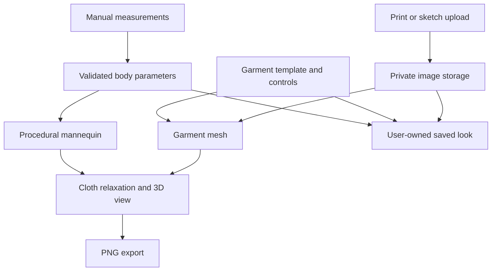

# FORM — Virtual Try-On

A working 3D fitting-studio prototype: enter body measurements, customise a garment, apply an uploaded fabric print, and save the outfit. Built for exploring a personalised virtual fitting room and a future costume-design workflow.

## What works now

- **Seven manual measurements** in centimetres or inches, with guidance and validation.
- **Measurement-driven 3D mannequin** with orbit, zoom, front/side/back views and automatic rotation.
- **Three garment templates:** T-shirt, straight trousers and A-line dress.
- **Independent clothing dimensions:** garment chest, waist, hips, shoulder width, length, sleeve length, inseam and rise are stored separately from the body. Moving body sliders changes placement and draping, not the garment rest dimensions.
- **Guided costume editor:** crew/scoop/V necklines; straight, tapered or flared hems/legs; straight or bell sleeves; centimetre-based dimensions and three illustrative size presets.
- **Measurement comparison:** body and garment values shown side by side with signed differences in centimetres.
- **Connected shoulders and collision-aware neckline:** upper garments use a single connected surface; sleeve roots share bodice vertices and neckline anchors are projected outside the collision envelope before rendering. Garment rest dimensions remain unchanged.
- **Refined mannequin and detailing:** continuous limb surfaces, a tapered jaw, ears, and garment neckline/cuff/side-seam guides that follow the cloth.
- **Basic cloth relaxation:** positional constraints, gravity, body collision and illustrative cotton/denim/silk presets.
- **Design uploads:** repeat PNG/JPEG/WebP artwork, or automatically suggest outline landmarks from a front-view sketch/photo using local contrast, background segmentation and connected components. Review or drag the points, then generate a symmetric garment. Default estimated sizing uses mannequin measurements and hip/knee/ankle endings; a known garment length remains optional.
- **Articulated arms:** independent shoulder lift, forward/backward motion and elbow bend, with relaxed, arms-out and wave presets. Posed cloth targets and collision capsules follow the limbs.
- **Private saved looks:** measurements, design choices and uploaded assets persist on the server and are scoped to the signed-in user.
- **PNG preview export** from the current 3D view.
- Responsive controls, keyboard-accessible dialogs, validation and recoverable save/upload errors.

The initial values are labelled **sample measurements**. Replace them before interpreting the avatar as your own proportions.

## Accuracy and current boundaries

This is a visual prototype, not a body-scanning or certified garment-fit system.

- The mannequin is procedural geometry with estimated proportions. It is **not** a scan, SMPL reconstruction or anatomically exact digital twin. Torso circumference controls use elliptical cross-sections; other proportions are inferred.
- Garments now retain their own dimensions independently of the mannequin. The examples are not retailer size charts and the app does not recommend S/M/L.
- Drape is paused when a compared circumference has less than 2 cm clearance or the garment shoulders are narrower than the body. This is a conservative numerical gate, not a physical fit threshold. Undersized templates may visibly intersect the body instead of silently expanding.
- Positive measurement differences do not establish comfort, correct fit, or that a garment can be put on. Closures, stretch, unmeasured limb circumferences and construction affect real fit.
- The cloth solver is a small position-based relaxation model with pinned vertices, structural/shear/bending constraints and approximate collision. It is not a calibrated textile solver. Overlaps, seam artefacts and unusual body/garment combinations can produce imperfect previews.
- Fabric labels select illustrative stiffness and shading presets; they do not represent measured material properties.
- A print upload changes the surface artwork. Design-to-3D uses **automatic image-processing suggestions with editable landmarks**, not an AI model. Default sizes are estimated from the mannequin; the image alone cannot provide exact real-world measurements. It generates wearable geometry, with an estimated elliptical depth and mirrored back; no sewing patterns, hidden seams, asymmetric layers, ruffles or cut-outs are reconstructed.
- Camera measurement, arbitrary sewing-pattern import, learned body reconstruction and physically validated fit prediction are future stages.
- Garment settings support the provided templates; this is not a sewing-pattern editor. T-shirt and dress sleeves share mesh vertices with their armholes, preventing disconnected shoulder seams. This is procedural connected geometry, not sewing-pattern reconstruction. Seam lines are visual guides.
- First-version saved looks are upgraded on read using their original saved measurements and settings. New looks store explicit garment dimensions. Existing database rows and migrations are not rewritten.

## Stack and architecture

| Layer               | Technology                                | Purpose                                                   |
| ------------------- | ----------------------------------------- | --------------------------------------------------------- |
| Interface           | React 19, TypeScript, Vinext/Vite         | Interactive fitting studio and server endpoints           |
| Controls            | Radix/Shadcn primitives, Tailwind, Lucide | Accessible input, tabs, dialogs and icons                 |
| 3D                  | Three.js, OrbitControls                   | Procedural meshes, lighting, camera and texture rendering |
| Cloth               | TypeScript position-based solver          | Approximate draping without a model download              |
| Validation          | Zod                                       | Shared measurement, garment and saved-look validation     |
| Structured storage  | Cloudflare D1 / SQLite                    | User-owned saved looks and upload metadata                |
| Image storage       | Cloudflare R2                             | Private design image bytes                                |
| Database migrations | Drizzle Kit                               | Versioned schema changes                                  |
| Hosting             | Sites / Cloudflare Workers                | Private app hosting and trusted identity forwarding       |



A sketch is consumed by the guided outline editor: confirmed landmarks become physical dimensions and a saved custom shape profile, which the mesh generator uses directly. This is a geometric workflow, not an AI inference pipeline. No external AI API key or GPU model download is required. Arm poses are temporary preview state; saved looks preserve the generated garment profile.

The pose rig deforms the cloth initialization and relaxation targets, while constraint rest lengths remain fixed. Changing a pose restarts the short drape pass. This is not continuous, calibrated cloth simulation; extreme poses and tight sizes may still intersect. Sleeve initialization now centres cuffs around the neutral arm axes instead of extending them from the torso-side centre.

## Run locally

Use **Node.js 24 LTS** and npm. On Windows, use Git Bash or WSL for the supplied shell-based build scripts.

```bash
git clone https://github.com/Praveenraj1618/Virtual-Try-on.git
cd Virtual-Try-on
npm ci
npm run db:local
npm run dev
```

Open the localhost URL printed by Vite. Local D1/R2 state is kept under `.wrangler`; the development server uses the same logical bindings as the local migration configuration.

The local migration configuration uses a placeholder D1 ID and is **only for local development**. Do not use it to deploy a production database. Sites provisions the production bindings from `.openai/hosting.json` and applies the checked-in migrations.

Production saved-data endpoints require the identity supplied by trusted Sites dispatch. Local development has an explicit identity fallback only for `localhost` and `127.0.0.1` when `NODE_ENV` is not `production`. Do not expose a standalone deployment that trusts client-supplied `oai-authenticated-user-id` headers: another hosting environment must replace this boundary with verified authentication.

## Validate and build

```bash
npm run typecheck
npm run test:core
npm test
```

`npm test` builds the Worker, then checks the rendered workspace and API behaviour using in-memory SQLite and an R2 test double. Tests cover validation, independent garment dimensions across body changes, connected manifold sleeve topology, collision-cleared neckline anchors, style geometry, legacy look migration, bounded cloth output across body/garment extremes, ownership isolation, save/load/delete and image format checks. They do not measure body-estimation accuracy or real-world garment fit. Browser visual testing is not part of this suite.

## API

| Endpoint                 | Behaviour                                                   |
| ------------------------ | ----------------------------------------------------------- |
| `GET /api/looks`         | Return up to 100 recent looks belonging to the current user |
| `POST /api/looks`        | Validate and save a named measurement/design snapshot       |
| `DELETE /api/looks?id=…` | Remove an owned saved look                                  |
| `POST /api/assets`       | Upload PNG, JPEG or WebP bytes, up to 5 MB                  |
| `GET /api/assets/:id`    | Return an image only to its owner                           |

Mutations check same-origin requests. Server validation prevents saved looks from referencing external image URLs or another user's assets. The browser also limits image dimensions to 4096 × 4096. Uploaded artwork remains stored when removed from a draft or when a look is deleted, so other looks can continue referencing it; full asset lifecycle cleanup is a future improvement.

## Project structure

```text
app/                 Page, layout, styles and HTTP endpoints
components/studio.tsx Fitting-room controls and saved-look workflow
components/avatar-viewer.tsx  Three.js scene lifecycle
components/garment-editor.tsx Dimensions, style choices and comparison table
lib/tryon/schema.ts  Shared data model and input validation
lib/tryon/model.ts   Mannequin and garment geometry
lib/tryon/cloth.ts   Position-based relaxation solver
lib/server.ts        Trusted identity and storage boundary
db/schema.ts         Database schema
drizzle/             Versioned SQLite migrations
tests/               Geometry, validation, rendering and API tests
public/              Built-in textile print and favicon
```

## Next development stages

1. **Body fidelity:** replace the procedural mannequin with a licensed parametric human body model and quantify measurement error against manually measured volunteers.
2. **Garment fidelity:** build on the independent dimensions with sewing patterns, stitched seam construction, improved armholes, body collision and calibrated fabric properties; evaluate against physical garments.
3. **Camera assistance:** guided front/side capture with known height, quality checks, uncertainty and manual correction. Never promise exact measurements from an ordinary photograph.
4. **Sketch assistance:** recognise supported garment attributes and populate editable templates. Ask for missing back details, dimensions and fabric properties.
5. **Pattern reconstruction:** research and validate sketch/image-to-pattern models before expanding to arbitrary costumes.

## Assets and third-party software

The built-in cobalt stripe print was generated for this project. The mannequin and garment geometry are authored procedurally; there are no external body-model weights or fashion datasets in the repository. Third-party dependencies retain their respective licences. Review model and dataset licences before adding research implementations or commercial inference services.

## V5 workspace and rendering

The mannequin stays visible beside a single tabbed tool panel (Body, Clothes, Upload, Pose, Size & fit, Saved). Mobile uses a split canvas/control layout. Design conversion opens in a larger dialog with draggable points, automatic sketch/photo detection and estimated sizing by default. Detector failures explain how to crop or adjust the outline; there are no AI API credentials or remote image-analysis calls. It works best with a single centred garment on a plain background. Layered sketches, people, complex backgrounds and disconnected strokes can mislead the detector and require corrections.

The rendered cloth uses shared midpoint subdivision (four triangles per simulation triangle) with collision projection at the added vertices. Simulation stays at its original resolution. Arm rendering follows the same segment axes as collision; shoulder influence blends continuously into the bodice and sleeve attachment is stronger. This reduces coarse-face penetration and posing distortion, but does not add self-collision or calibrated cloth physics. Severe poses can still produce folds/intersections. Browser visual testing has not been performed.
